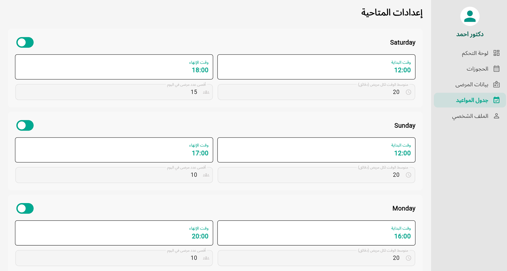
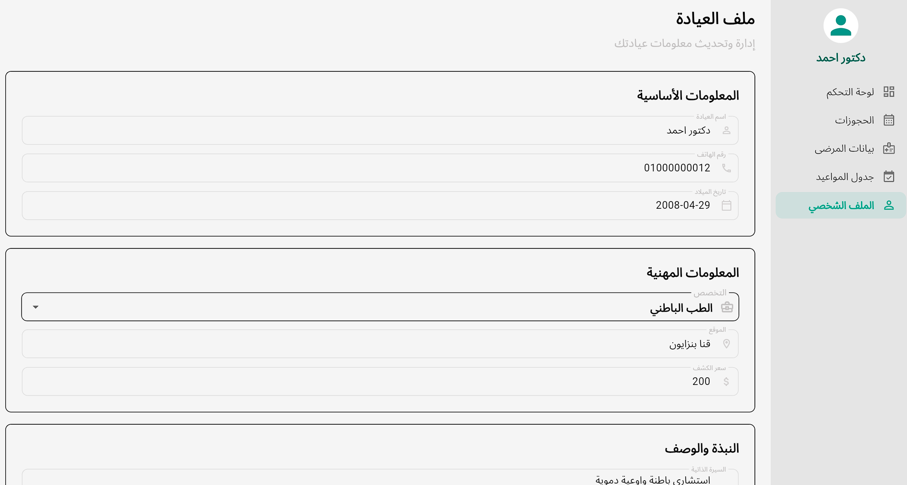
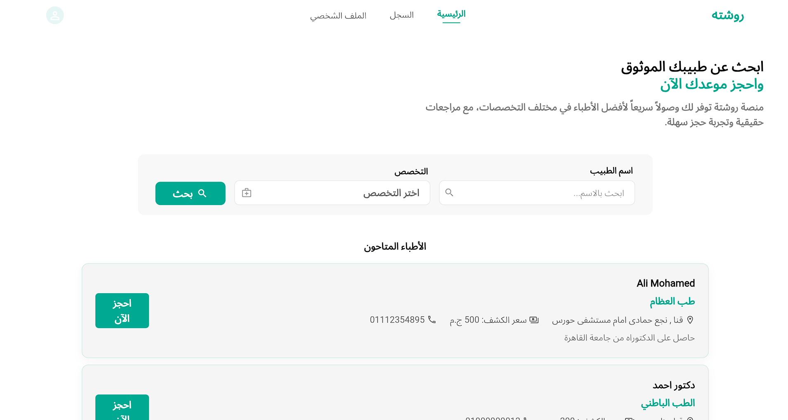
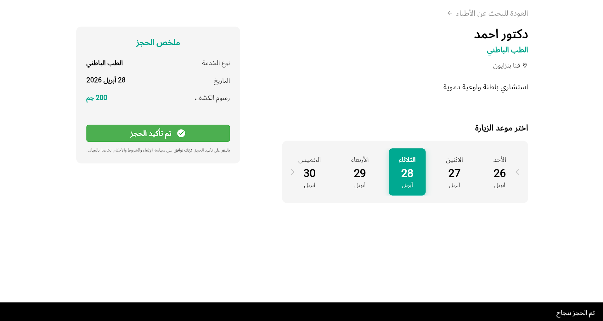

<!-- markdownlint-disable MD033 -->
<!-- markdownlint-disable MD045 -->
<!-- markdownlint-disable MD040 -->
# Roshetta (IEEE SVU Hackathon Project)

Roshetta is a medical web app developed during a hackathon organized by IEEE SVU. The platform makes it easy for patients to add appointments and track the accepted time.

The project was completed in a total of 4 days. During this period, the team chose the idea from a provided list, developed the concept, implemented the app, and prepared the final presentation and pitching. Due to the very short 4-day timeframe, the app is not fully implemented.

## App Images

<div align="center">
  
  
  
  
  
  
</div>

## Project Structure

The codebase is organized into four primary directories under `lib/`, each with a distinct responsibility:

```

lib/
├── core/                # The backbone of the application (Shared logic)
│   ├── di/              # Service locator (GetIt) configuration
│   ├── services/        # Data access wrappers (Dio, Shared Preferences)
│   ├── routing/         # Centralized route definitions (GoRouter)
│   └── theme/           # App-wide styling and localization (AR/EN)
├── features/            # Domain-specific logic (e.g., auth, course, explore)
│   ├── [feature_name]/
│   │   ├── data/        # Repository implementations & DTO models
│   │   ├── domain/      # Business logic & repository interfaces
│   │   └── presentation/# UI components & BLoC state management
├── root/                # Top-level navigation shell & Auth-state rendering
└── main.dart            # Entry point & Service Locator initialization

```

## Technical Stack

* **State Management**: [flutter_bloc](https://pub.dev/packages/flutter_bloc) for predictable state transitions.
* **Networking**: [Dio](https://pub.dev/packages/dio) with a custom `ApiConsumer` abstraction.
* **Dependency Injection**: [GetIt](https://pub.dev/packages/get_it) for lazy-loading services and repositories.
* **Navigation**: [GoRouter](https://pub.dev/packages/go_router) for deep-linking and declarative routing.
* **Data Consistency**: [dartz](https://pub.dev/packages/dartz) for functional error handling using `Either<Failure, Success>`.
* **UI Scaling**: [flutter_screenutil](https://pub.dev/packages/flutter_screenutil) for responsive layouts across different screen sizes.

---

## Development Team

### Flutter Team

* [Abdallah Alqiran](https://github.com/Abdallah-Alqiran) "Team Leader"
* [Taha Saber](https://github.com/Taha-Saber)
* [Mayar Abdelrahim](https://github.com/Mayar-Abdelrahim)

### Back-End Team

* [Youssef Shabaan](https://github.com/Youssef-Shabaan)
* [Hussein Hashiem](https://github.com/Hussein-Hashiem)
* [Ibrahim Ali](https://github.com/ibrahimali101)

[backend code](https://github.com/Hussein-Hashiem/Roshetta)
